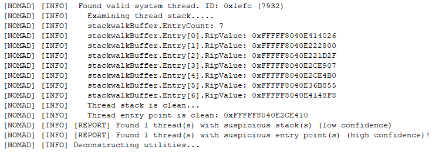

# Nomad
Uses known heuristic detection methods to find manulaly mapped kernel code and suspicious threads.  
# Features

**Threads**
- Stack walk system threads
- Check thread entry points

**Hook Detection**
- Checks for driver IOCTL hooks

**Big Pool Scans**
- Checks big pools referenced by a non-legit address

# Credits
- ApexLegendsUC (anti-cheat-emulator)
- Credits not listed here are in code comments
